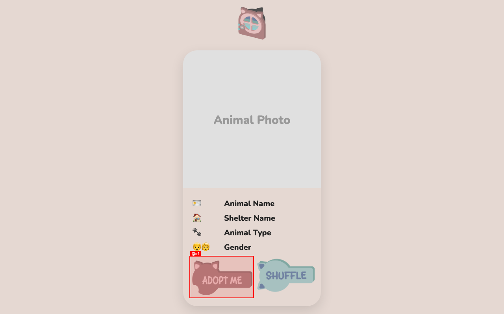

# QA Report: useopendoor.com

**Date:** 2026-03-13
**Mode:** Quick (Smoke Test)
**Duration:** ~30 seconds
**URL:** https://useopendoor.com

---

## Summary

| Metric | Value |
|--------|-------|
| **Health Score** | 100/100 |
| Pages Tested | 1 |
| Console Errors | 0 |
| Broken Links | 0 |
| Screenshots | 1 |

---

## Health Score Breakdown

| Category | Score | Weight | Weighted |
|----------|-------|--------|----------|
| Console | 100 | 15% | 15 |
| Links | 100 | 10% | 10 |
| Visual | 100 | 10% | 10 |
| Functional | 100 | 20% | 20 |
| UX | 100 | 15% | 15 |
| Performance | 100 | 10% | 10 |
| Content | 100 | 5% | 5 |
| Accessibility | 100 | 15% | 15 |
| **Total** | | | **100** |

---

## Test Results

### Page Load
- ✅ Homepage loads successfully (HTTP 200)
- ✅ All static assets load (CSS, JS, images, fonts)
- ✅ Animal data API (`/get_data`) responds correctly
- ✅ Cloudinary images load successfully

### Console Health
- ✅ No JavaScript errors
- ✅ No warnings
- ✅ No hydration issues (vanilla JS app)

### Network Health
- ✅ All 13 requests return 200 OK
- ✅ No failed requests
- ✅ No pending requests blocking page

### Interactive Elements
- ✅ **Shuffle button** (@c3): Works correctly, loads new animal data
- ✅ **Adopt button** (@e1): Links to external shelter sites with `target="_blank"`

### Links
- ✅ 1 external link found (Adopt Button)
- ✅ All links functional

---

## Screenshots

**Initial Page Load:**

---

## Top 3 Things to Fix

No issues found in quick smoke test. The application is functioning correctly.

---

## Notes

- Single-page application displaying animal adoption profiles
- Animal data sourced from MongoDB via `/get_data` endpoint
- Images hosted on Cloudinary
- External adoption links open in new tabs
- Responsive design (vanilla CSS)

---

## Framework Detection

- **Framework:** Flask (Python) + Vanilla JS
- **Deployment:** Vercel
- **Database:** MongoDB Atlas
- **Image CDN:** Cloudinary
